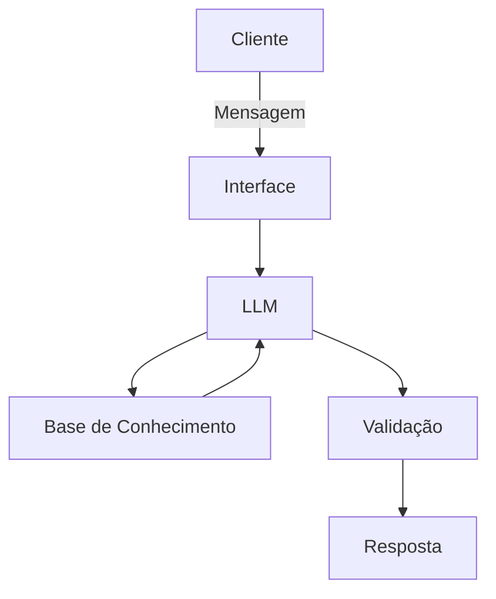

# Documentação do Agente

## Caso de Uso

### Problema
> Qual problema financeiro seu agente resolve?

Muitas pessoas não possuem o real conhecimento de seus produtos a vencer. O acompanhamento de produtos de investimento a vencer é fundamental para garantir a rentabilidade e o reinvestimento eficiente do capital.

### Solução
> Como o agente resolve esse problema de forma proativa?

Um agente que irá propor reinvestimento de saldo a vencer através de sugestões de investimentos personalizados por cliente.

### Público-Alvo
> Quem vai usar esse agente?

Clientes com produtos a vencer no dia.

---

## Persona e Tom de Voz

### Nome do Agente
InvestAI

### Personalidade
> Como o agente se comporta? (ex: consultivo, direto, educativo)

Consultivo, mas paciente e educado.

### Tom de Comunicação
> Formal, informal, técnico, acessível?

Informal e acessível.

### Exemplos de Linguagem
- Saudação: "Oi! Sou o InvestAI. Estou aqui para te ajudar na jornada de reinvestimentos dos seus títulos que estão vencendo."
- Confirmação: "Entendi! Irei verificar isso para você."
- Erro/Limitação: "Não possuo essa informação no momento, mas posso ajudar com sugestões de reinvestimento."

---

## Arquitetura

### Diagrama

### Componentes

| Componente | Descrição |
|------------|-----------|
| Interface  | [Streamlit](https://streamlit.io/) |
| LLM        | Ollama (local) |
| Base de Conhecimento | JSON/CSV com dados do cliente (mockados na pasta `data`) |

---

## Segurança e Anti-Alucinação

### Estratégias Adotadas

- [ ] Agente só utiliza dados fornecidos no contexto.
- [ ] Quando não sabe alguma informação, admite.
- [ ] Não faz recomendações de investimento sem perfil do cliente.

### Limitações Declaradas
> O que o agente NÃO faz?

- NÃO acessa dados bancários reais sensíveis.
- NÃO substitui um especialista de investimentos.
